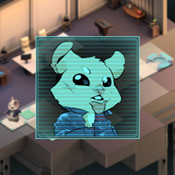

# Agent OwO

Agent OwO is an isometric puzzle game. In the game you play as Agent OwO, a hamster spy who just succeeded in infiltrating and stealing vital intelligence from evil cat mastermind Hermann Von Grouchenstein. You have to escape Von Grouchensteins lair so Agent OwO can use the intelligence to stop Von Grouchenstein.

Agent OwO is made as part of a school assignment for the Creative Media and Game Technologies course of Saxion in Enschede. It is made by 4 artists/designers and 1 programmer

### Project Description
Agent OwO is the result of a 5 week school project. The assignment was to create a game using a custom C++ engine made by yourself.
Agent OwO is a 3D isometric puzzle game. It is inspired by games like Transistor and old top down Zelda games. The player has to navigate through a level and solve [sokoban][5]-style puzzles. The different levels are tied together with a story that is told through dialogues at the start and end of levels.

[Development Blog][6]

---

### My Responsibilities
I did the following things during the project:
- Create Tools
- Implement gameplay
- Implement audio
- Implement user interface functionality
- Organisation

I was the only engineer on the team during this project so I was responsible for everything programming related. 

#### Engine
The engine is based on the Micro Game Egine(MGE) basis Saxion provided. MGE included the [SFML][7], [GLM][8] and [GLEW][9] libraries. I extended the MGE basis with a Lua binding. 

#### Lua
I used Lua because it is easy to bind with C++ and Lua files are easy to read and change for people. In the end designers could specify inside Lua files which assets should be used, change audio levels, change positions of UI elements and specify which dialogue should show when. Lua files were also used to save the transforms of game objects for the levels.

#### Gameplay
The gameplay being based on isometric sokoban style puzzles simplified things for me. Levels consists of tiles that connect to eachother to create a node graph. The player and other important gameplay objects were then placed on the node graph. Simplifying "collision" checking to checking if a node existed in that direction and if it's walkable or not. Besides the node graph I used an event queue to pass messages around to decouple game objects from each other.

#### Audio
I used SFML's audio module to take care of the audio for the game. I created an AudioManager class that would take care of loading all the sound effects into memory and streaming the background music. Using the service locator pattern it was easy to play sound effects from anywhere in the code. 

#### User Interface
SFML's graphic module is used to draw the the UI images and text on screen. I'm least proud of the implementation of the UI. I didn't really take the time to design the code up front. While writing the code I didn't want to stop to refactor so it would be easier to implement everything.

#### Organisation
As the only engineer on the team my time was valuable. During the project my aim was to only add features that were necessary or we really wanted in. To do this I had to be very involved with the organisational side of things. Together with the lead designer I would often discuss if it was still possible to implement all the features we wanted. 

#### Tools
For more info on the tools check the [Tools repository][10]

---
### Basic Info
**Duration:** 4 weeks

**Date:** 15-03-2019

**Engine:** Custom C++ engine

**Team Size:** 5 people

**Designers:**
- [Erika Batarunaite][2]: Character Artist, UI Design, 2D art
- [Selima Heister][11]: 3D Props, Sound Design
- [Stimona Milanova][3]: Art Lead, Level Design, 3D Environment
- [Inken Starosta][12]: Character Artist, Level Design, 3D Props

**Engineer:**
- Tristan Smeets

 [2]: https://www.artstation.com/eriminati
 [3]: https://www.artstation.com/milva
 [4]: https://github.com/TristanSmeets/Agent-OwO
 [5]: https://en.wikipedia.org/wiki/Sokoban
 [6]: https://brocknoeyes99.tumblr.com/page/4
 [7]: https://www.sfml-dev.org/
 [8]: https://glm.g-truc.net/0.9.9/index.html
 [9]: http://glew.sourceforge.net/
 [10]: https://github.com/TristanSmeets/Agent-OwO-Tools
 [11]: https://www.artstation.com/selimahei
 [12]: https://inkenstarosta.com/
